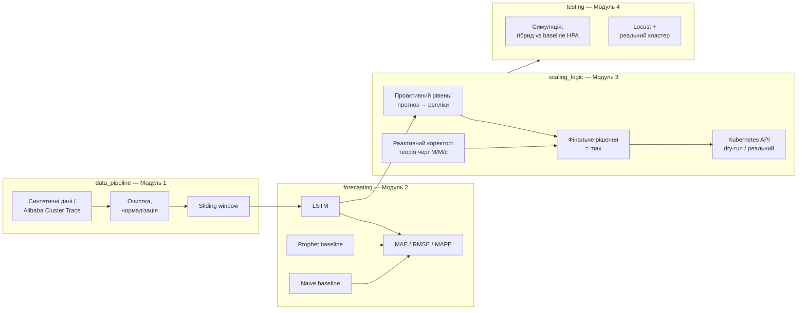

# Розробка та дослідження методики динамічного розподілу ресурсів хмарних серверів на основі методів машинного навчання

Магістерська кваліфікаційна робота, спеціальність 122 «Комп'ютерні
науки», Національний університет «Одеська політехніка», Інститут
комп'ютерних систем.

## Суть роботи

Існуючі системи балансування навантаження (AWS ELB, GCP Cloud LB,
Azure LB) реагують на перевантаження ПІСЛЯ того, як воно вже сталось —
запуск нового сервера займає 1-5 хвилин, протягом яких система
деградує. Ця робота пропонує **гібридну методику**: проактивний рівень
(LSTM прогнозує навантаження на 15 хв вперед і готує ресурси
заздалегідь) + реактивний коректор (теорія черг реагує на непередбачені
сплески, які прогноз пропустив).

## Архітектура рішення



## Структура репозиторію

```
cloud-autoscaling/
├── README.md                    # цей файл
├── requirements.txt
├── .gitignore
├── .gitattributes
├── .vscode/settings.json
│
├── data_pipeline/                # Модуль 1: збір і підготовка даних
│   ├── data_generator.py         # синтетичний генератор навантаження
│   ├── load_alibaba_data.py       # завантаження реального Alibaba trace
│   ├── preprocessing.py           # очистка, нормалізація, sliding window
│   ├── eda.py                      # розвідувальний аналіз + графіки
│   └── data/, plots/, README.md
│
├── forecasting/                   # Модуль 2: ML-прогнозування
│   ├── lstm_model.py               # LSTM (TensorFlow/Keras)
│   ├── prophet_model.py             # Prophet baseline
│   ├── evaluate.py                  # MAE/RMSE/MAPE: LSTM vs Prophet vs naive
│   └── models/, results/, README.md
│
├── scaling_logic/                  # Модуль 3: логіка масштабування
│   ├── config.py                    # усі пороги в одному місці
│   ├── decision_engine.py            # проактивний рівень + cooldown
│   ├── queuing_corrector.py           # реактивний коректор (M/M/c, Erlang C)
│   ├── k8s_client.py                  # інтеграція з K8s (dry-run за замовч.)
│   ├── autoscaler.py                   # orchestrator обох рівнів
│   ├── sanity_checks.py                # перевірка коректності математики
│   └── README.md
│
└── testing/                         # Модуль 4: тестування й порівняння
    ├── simulate_comparison.py        # ГОЛОВНИЙ файл: гібрид vs baseline HPA
    ├── baseline_scaler.py             # реактивний threshold-скейлер
    ├── pod_fleet.py                    # симулятор затримки старту подів
    ├── locustfile.py                   # для живого тесту (потрібен кластер)
    ├── k8s/baseline_hpa.yaml            # манифест реального HPA
    └── results/, README.md
```

## Встановлення

```powershell
python -m venv venv
venv\Scripts\activate
python -m pip install -r requirements.txt
```

Детальні інструкції по кожному модулю — у відповідному README (напр.
`forecasting/README.md` про встановлення Prophet/CmdStan на Windows).

## Відповідність модулів розділам кваліфікаційної роботи

| Модуль           | Розділ роботи              | Що дає                                                                                         |
| ---------------- | -------------------------- | ---------------------------------------------------------------------------------------------- |
| `data_pipeline/` | 1.1, 2.1                   | Обґрунтування проблеми (EDA: сплеск CPU на 63 в.п. за 15 хв), підготовка даних                 |
| `forecasting/`   | 1.2-1.3, 2.1               | Критерій "точність прогнозування навантаження" (MAE/MSE)                                       |
| `scaling_logic/` | 2.2-2.3                    | Реалізація гібридної методики (архітектура системи)                                            |
| `testing/`       | 2.1, 3 (експ. дослідження) | Решта 5 критеріїв ефективності + порівняння з "традиційними методами" (задача 6 з мети роботи) |

## Ключові результати

**Точність прогнозування (Модуль 2, на синтетичних даних):**

| Модель            | MAE  | RMSE | MAPE, % |
| ----------------- | ---- | ---- | ------- |
| LSTM              | 3.71 | 5.00 | 15.09   |
| Naive persistence | 3.69 | 5.25 | 16.35   |
| Prophet           | 4.71 | 5.86 | 49.34   |

**Порівняння з baseline (Модуль 4, симуляція, startup_delay=3 хв — типовий сценарій з ТЗ):**

| Критерій                      | Гібридна методика | Baseline (threshold HPA) |
| ----------------------------- | ----------------- | ------------------------ |
| Кількість подій масштабування | **7946** (-33%)   | 11903                    |
| SLA compliance                | 95.25%            | 96.82%                   |
| Вартість                      | $306.78           | $298.91                  |

**Аналіз чутливості** (`testing/results/sensitivity_analysis.png`) показує,
що перевага гібридної методики по SLA зростає разом із часом
розгортання нового екземпляра сервісу і стає виразною (>5 в.п.) при
startup_delay ≥ 8-10 хв — саме та умова, що й була вихідною мотивацією
роботи (п. 1.1). Головна стала перевага, незалежна від startup_delay —
**стабільність** (-33% подій масштабування).

## Відомі обмеження та напрями подальшої роботи

- **Живе тестування через Locust + реальний Kubernetes** підготовлене
  повністю (тестовий сервіс, K8s-манифести, покрокова інструкція —
  `testing/LIVE_TEST_GUIDE.md`), спроба розгортання на Docker Desktop
  Kubernetes була зроблена, але зупинена через неповну ініціалізацію
  локального кластера (типова проблема однонодових локальних
  кластерів, не пов'язана з кодом методики). Результати ефективності
  в роботі базуються на симуляційному порівнянні
  (`testing/simulate_comparison.py`) — обґрунтований і відтворюваний
  метод оцінки, детальніше — `testing/README.md`. Жива валідація
  лишається готовим напрямом подальшої роботи.
- **Реальний Alibaba Cluster Trace** (`load_alibaba_data.py`) дає лише
  ~8 днів даних — LSTM на ньому має auto-scaled легшу архітектуру
  (`forecasting/lstm_model.py`), результати на реальних даних варто
  окремо задокументувати в тексті роботи поруч із синтетичними.
- Вартість (`total_cost_usd`) — умовна одинична модель
  (`$/репліка-хвилина`), не прив'язана до тарифів конкретного хмарного
  провайдера; для точнішої оцінки варто підставити реальні тарифи
  (AWS/GCP/Azure) відповідно до того, яку платформу оберете для
  фінального розгортання.

## Технічний стек

Python 3.12, TensorFlow 2.21, Prophet 1.4 (CmdStan backend),
scikit-learn, Kubernetes Python client, Locust, pandas/numpy/matplotlib.
